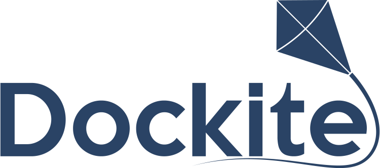

> A Powerful HeadlessCMS written in Typescript utilising Apollo GraphQL, Typeorm, TypeGraphQL and GraphQL Modules

## Table of Contents

- [Installation](#installation)
- [Development](#development)
- [Contributing](#contributing)

## Installation

The best way to get up and running with Dockite is via the Dockite CLI as follows:

1. Install the Dockite CLI `yarn global add @dockite/cli`
2. Create a new project `dockite new <project-name>`
3. Build the Admin UI `dockite build`
4. Run the server `node server.js`

## Development

Dockite is set up as a monorepo with each package implementing a singular and specific feature that is required for the `core` and `admin` packages to function.

To contribute to Dockite, it should be possible to pick a package which interests you and work on updates independent of other packages. This modularity supports parts of the application being upgraded individually as required, rather than only supporting monolithic upgrades.

Get started with development by following the steps below:

### Clone

- Clone this repo to your local machine using `git clone https://github.com/dockite/dockite.git`

### Setup

Once cloned use yarn and lerna to bootstrap the project.

```shell
$ yarn
$ yarn lerna bootstrap
```

## Contributing

All contributions are welcome. If you would like to report an issue when using Dockite, please create an issue using the templates provided. Otherwise, start hacking away and submit a PR when ready.

If your change isn't accepted as it's too specific to your niche you can always add it into the system via local modules.